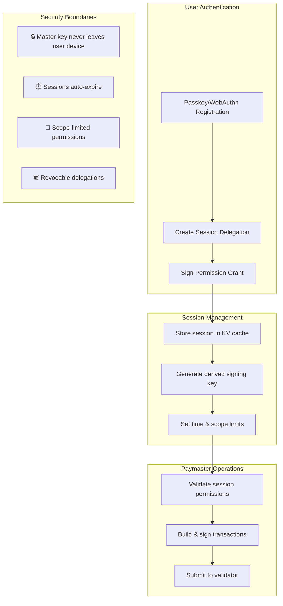
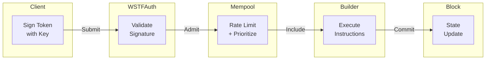
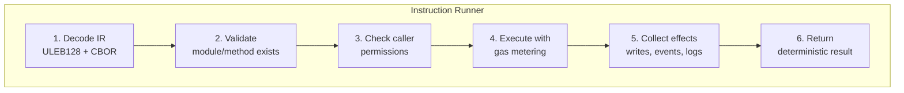

# WSTFChain v1.1 🚀

<!-- Version & Release -->


<!-- CI & Build Status -->
[](https://github.com/wasserstoff-india/wstf/actions/workflows/ci.yml)
[](https://github.com/wasserstoff-india/wstf/actions/workflows/benchmark.yml)
[](https://github.com/wasserstoff-india/wstf/actions/workflows/check.yml)

<!-- Bridge & Cross-Chain -->


<!-- Security & Auth -->


<!-- Architecture -->


<!-- Tech Stack -->


> **Production blockchain for cross-chain bridge coordination and access control. The "brain" for multi-chain operations with deterministic instruction processing, competitive bridge marketplace, and gated frontend framework.**

---

## 🚀 Quickstart (Local Devnet)

```bash
# Clone and setup
git clone https://github.com/wasserstoff-india/wstfchain.git
cd wstfchain

# One-command setup (installs Node.js if needed)
./scripts/wstfctl.sh setup

# Run interactive setup
./scripts/wstfctl.sh run --interactive
```

**What you get:**
- ✅ **Working bridge system** with route optimization and trust scoring
- ✅ **Access-controlled demos** running on `http://localhost:3000`
- ✅ **Production-ready SDKs** for backend and frontend integration
- ✅ **Complete test flows** demonstrating the bridge system

## 📦 SDK & Frontend Integration

### Backend/Node SDK (`@wstf/sdk`)
```bash
npm install @wstf/sdk
```

```typescript
import { WSTFSDK } from '@wstf/sdk';

// Connect to testnet
const sdk = WSTFSDK.createForNetwork('testnet', signer);

// Discover bridge routes
const routes = await sdk.bridge.listRoutes({
  srcChain: 'bsc',
  dstChain: 'polygon',
  token: 'USDT'
});

// Create bridge order
const order = await sdk.bridge.openOrder({
  routeId: routes[0].routeId,
  userAddress: sdk.address,
  srcAmount: 1000n * 1_000_000n,
  dstAddress: '0x742d35...'
});
```

### Frontend/React Kit (`@wasserstoff/wstf-kit`)
```bash
npm install @wasserstoff/wstf-kit
```

```tsx
import {
  WstfProvider,
  BridgeForm,
  ProtectedPage,
  NetworkSwitcher
} from '@wasserstoff/wstf-kit';

function App() {
  return (
    <WstfProvider network="testnet" autoConnect={true}>
      <div className="min-h-screen">
        <header className="flex justify-between p-4">
          <h1>My Bridge App</h1>
          <NetworkSwitcher showLabel={true} />
        </header>

        <BridgeForm
          supportedChains={['bsc', 'polygon', 'eth']}
          onBridgeSubmit={handleBridge}
        />

        <ProtectedPage orgId="my.app" permission="premium">
          <PremiumFeatures />
        </ProtectedPage>
      </div>
    </WstfProvider>
  );
}
```

---

## Table of Contents

- [Quickstart](#quickstart-local-devnet)
- [SDK & Frontend Integration](#sdk--frontend-integration)
- [What WSTFChain Does](#what-wstfchain-does)
- [Bridge System](#bridge-system)
- [Access Control](#access-control)
- [Architecture](#architecture)
- [Testing & Verification](#testing--verification)
- [Network Profiles](#network-profiles)
- [Development](#development)
- [Documentation](#documentation)
- [Contributing](#contributing)

---

## The Problem

Multi-chain applications need a coordination layer that can:
- Verify signatures from any chain without trusting external RPCs
- Execute deterministic logic that produces identical results on every node
- Maintain auditable state with optimistic concurrency
- Authenticate requests with cryptographic proof of identity
- Compose services independently (run what you need, nothing more)

## The Solution

WSTFChain is a **programmable instruction plane** for the multi-chain world:

- **Language-agnostic**: Binary IR (ULEB128 + canonical CBOR) works with any client
- **Deterministic**: Pure execution—same inputs always produce same outputs
- **Authenticated**: Native WSTFAuth tokens with Ed25519/secp256k1 signatures
- **Event-sourced**: Structured logs with indexed topics for efficient queries
- **Composable**: Service connector SDK for building integrations
- **Auditable**: Git-like state versioning with Merkle proofs

---

## What It Can Do Today

| Capability | Description |
|------------|-------------|
| **Create identities** | Generate Ed25519/secp256k1 keys, derive addresses, bind usernames |
| **Authorize actions** | WSTFAuth tokens with audience binding, expiry, and signature verification |
| **Manage state** | REG/INIT/UPDATE with optimistic concurrency and deterministic merges |
| **Record signatures** | SIGN opcode anchors signatures (auditable, hashed into state) |
| **Verify signatures** | VERIFY opcode validates signatures inside programs (consensus-critical) |
| **Accept attestations** | XVAL opcode for cross-chain receipts with proof bundles (stub) |
| **Emit events** | Structured event logs with indexed topics (up to 4 per event) |
| **Register programs** | On-chain program registry with policies, access control, and stats |
| **Connect services** | SDK for building external service integrations with auth flow |
| **Anti-spam protection** | Rate limiting, trust tiers, and paymaster sponsorship |
| **Gossip transactions** | P2P dedup + rate limiting; mempool policies by size/sender |
| **Produce blocks** | Builder mines at configurable target; validator re-executes and checks roots |
| **Fork choice** | Cumulative-work tip selection with reorg handling |
| **On-chain orderbook** | Markets module with LP grids, escrow, OCC, bounded matching |
| **Zk-RPC & DNS** | Username-DNS mapped RPC routing for opaque transaction relaying |
| **Closed Box Execute**| SecureContext gated secret access for protected service operations |
| **Token Showcase** | Integrated TOK_DEPLOY and TOK_MINT_PROTECTED demo via VaultService |
| **Bridge Marketplace**| Multi-provider route discovery with competitive fee matching |
| **Trust Scoring** | Dynamic trust scoring (0-1000) based on successful completions |
| **Zero-Trust Keys** | Enforced client-side only key generation (No server-held private keys) |

---

## Quick Start

```bash
# Clone
git clone https://github.com/wasserstoff-india/wstf.git
cd wstf

# Install & build
npm install && npm run build

# Run all tests (1369 passing)
npm run test:full

# Start services
npm start                    # accounts + validator + explorer
npm run start:m3             # + p2p + mempool
```

---

## Architecture

```mermaid
flowchart TB
    subgraph Applications
        A1[Compiler API]
        A2[Identity RPC]
        A3[Explorer / Indexer]
    end

    subgraph Services["Service Layer"]
        S1[Accounts<br/>:7001]
        S2[Validator<br/>:7002]
        S3[Mempool<br/>:7004]
        S4[Builder<br/>:7005]
        S5[Connectors<br/>SDK]
    end

    subgraph Auth["Auth Layer - WSTFAuth"]
        AU[Token: base64url.signature<br/>Claims: sub, aud, iat, exp, jti<br/>Algorithms: Ed25519, secp256k1]
    end

    subgraph Core["Core Engine"]
        C1[Executor<br/>deterministic]
        C2[Instruction Runner]
        C3[Event Logs<br/>indexed]
        C4[SYS Module<br/>9 opcodes]
        C5[PROG Module]
    end

    subgraph Consensus["Consensus Layer"]
        CO1[Block Types<br/>184B header]
        CO2[PoW Mining<br/>2xSHA256]
        CO3[Fork Choice<br/>cum. work]
    end

    subgraph Network["Network Layer"]
        N1[P2P Gossip<br/>CBOR]
        N2[Rate Limiting]
        N3[Peer Management]
    end

    subgraph Storage["Storage Layer"]
        ST1[Chain Store]
        ST2[State Store]
        ST3[Account Store]
    end

    Applications --> Services
    Services --> Auth
    Auth --> Core
    Core --> Consensus
    Consensus --> Network
    Network --> Storage
```



### Directory Structure

```
src/
├── crypto/              # Ed25519, secp256k1, address derivation
├── auth/                # WSTFAuth token signing/validation
│   ├── wstf.ts          # Core auth implementation
│   ├── wstf.test.ts     # Unit tests (27 tests)
│   └── wstf.chaos.test.ts # Chaos tests (49 tests)
├── tx/                  # Tx v1 (basic) and v2 (instructions)
├── instructions/        # Binary IR, ABI, compiler, decoder
├── executor/            # Deterministic execution engine
│   └── modules/         # SYS, PROG modules
├── events/              # Structured event logging
│   └── logs/            # Indexed event logs with topics
├── programs/            # Program registry and policies
├── service/             # Service connector SDK
│   ├── connector/       # Auth flow, SecureContext, mood game harness
│   └── demo/            # Power Showcase: VaultService & Token Demo
├── trust/               # Trust tiers, confirmation tracking
├── fastpath/            # Hot Window, Preflight, Journal
├── economics/           # Gas metering, fees, rent, balances
├── paymaster/           # Sponsorship, vouchers
├── accounts/            # Account state management
├── validator/           # Transaction validation & opaque relaying
├── rpc/                 # RPC services (DNS Resolver, standard endpoints)
├── p2p/                 # Gossip protocol, peer management
├── mempool/             # Transaction pool with policies
├── block/               # Block types, PoW, Merkle roots
├── chain/               # Chain store, fork choice, block builder
├── storage/             # KVStore abstraction, memory adapter
├── observability/       # Health endpoints, metrics
├── registry/            # INS module registry
├── markets/             # On-chain orderbook module
│   ├── types.ts         # Branded types, interfaces
│   ├── store.ts         # InMemoryMarketStore
│   └── exec.ts          # Execution helpers
├── explorer/            # Query service
├── config/              # Feature flags, configuration
├── runner/              # Service orchestration
├── integration/         # E2E and determinism tests
└── test/                # Smoke tests

test/
├── unit/                # Unit tests
├── differential/        # 2-node determinism tests
└── vectors/             # Golden test vectors
```

---

## Wallet Architecture & Security

### 🔒 Security-First Design

WSTFChain implements a **zero-trust wallet architecture** where:
- **Client-side key generation only** - No private keys ever touch the server
- **Validator agnostic** - Validates any properly signed transaction regardless of key origin
- **Account abstraction ready** - Session keys, paymasters, and delegation support
- **Multi-signature algorithms** - Ed25519, secp256k1, and future WebAuthn/P-256 support

### Wallet Types & Usage Patterns

| Wallet Type | Key Location | Security Model | Use Case |
|-------------|-------------|----------------|----------|
| **Paper Wallet** | Offline/Cold storage | Maximum security | Long-term storage, inheritance |
| **Client SDK** | Browser/App memory | User-controlled | DApp interactions, trading |
| **Session Keys** | Limited delegation | Time & scope bounded | Account abstraction, automation |
| **Paymaster Keys** | Server-held delegation | Policy-restricted | Gas sponsorship, high-frequency ops |

### Account Registration Flow

```mermaid
flowchart TB
    subgraph "Client Side (Secure)"
        A1[Generate Keypair<br/>Ed25519/secp256k1]
        A2[Derive Address<br/>from Public Key]
        A3[Sign WSTFAuth Token<br/>for Registration]
    end

    subgraph "Network"
        N1[POST /accounts/register<br/>{ publicKey, address, sigAlg }]
    end

    subgraph "Accounts Service"
        S1[Verify pubkey matches address]
        S2[Store account metadata<br/>NO private key]
        S3[Return registration confirmation]
    end

    subgraph "Validator"
        V1[Accept transactions from<br/>ANY valid address]
        V2[Verify signatures against<br/>registered OR embedded pubkey]
    end

    A1 --> A2 --> A3 --> N1
    N1 --> S1 --> S2 --> S3
    V1 --> V2
```

### Enhanced Paper Wallet Generation

The SDK provides **military-grade entropy** for paper wallet generation:

```typescript
import { generatePaperWallet } from '@wstf/sdk';

// Enhanced entropy with multiplication method
const wallet = generatePaperWallet({
  sigAlg: 'ed25519',
  useEnhancedEntropy: true,
  useMultiplicationMethod: true  // Multiplies 2 random numbers
});

console.log(wallet.entropy);
// {
//   sources: ['os-random', 'high-res-timer', 'process-entropy', 'multiplication-method'],
//   totalBits: 512,
//   method: 'enhanced-multiplication'
// }
```

**Entropy Sources:**
- **OS Random** - Primary cryptographic randomness from operating system
- **High-res Timer** - Microsecond-precision timing variations
- **Process Entropy** - Process-specific memory and state variations
- **Multiplication Method** - Two large randoms multiplied for complex patterns

### Account Abstraction & Session Management



### Secure Account Registration

**✅ Secure Pattern (Client-Side Only):**
```typescript
// 1. Client-side key generation
const signer = createSigner('ed25519');

// 2. Register public key only
fetch('/accounts/register', {
  method: 'POST',
  body: JSON.stringify({
    address: signer.address,
    publicKeyBase64: Buffer.from(signer.getPublicKeyDER()).toString('base64'),
    sigAlg: 'ed25519'
  })
});

// 3. Server NEVER sees private key
```

### Security Guarantees

| Property | Implementation | Status |
|----------|----------------|---------|
| **No server key generation** | All keys generated client-side | ✅ **ENFORCED** |
| **Public key verification** | Address derivation validation | ✅ **ENFORCED** |
| **Session-based delegation** | Time & scope limited capabilities | ✅ **AVAILABLE** |
| **Audit trail** | All registrations logged | ✅ **ENABLED** |

---

## How It Works

### 1. Transaction Flow



### 2. Instruction Execution



### 3. Event Emission

```typescript
// Emit structured event with indexed topics
emitEvent({
  module: 'SYS.PROG',
  key: eventKeyFromString('PROGRAM_REGISTERED'),
  topics: [
    topicFromString(programId),    // Topic 0: Program ID
    topicFromAddress(owner),       // Topic 1: Owner address
  ],
  data: encodeEventData({ name, version })
});
```

---

## WSTFAuth System

### Token Format

```
<base64url(JSON payload)>.<signature hex>
```

### Payload Claims

| Claim | Type | Required | Description |
|-------|------|----------|-------------|
| `sub` | string | Yes | Subject (gc1... address) |
| `aud` | string | Yes | Audience (program ID) |
| `iat` | number | Yes | Issued at (Unix timestamp) |
| `exp` | number | Yes | Expiry (Unix timestamp) |
| `jti` | string | No | Unique token ID (replay protection) |
| `method` | string | No | HTTP method binding |
| `path` | string | No | Path binding |
| `scope` | string[] | No | Permission scopes |

### Example Usage

```typescript
import { signToken, validateToken } from './auth/wstf';
import { generateKeypair } from './crypto/keys';
import { deriveAddress } from './crypto/address';

// Generate identity
const keypair = generateKeypair(SigAlgId.ED25519);
const address = deriveAddress(exportPubDER(keypair.publicKey), ...);

// Sign token
const token = signToken(keypair.privateKey, SigAlgId.ED25519, {
  sub: address,
  aud: 'my.program/v1',
  iat: Math.floor(Date.now() / 1000),
  exp: Math.floor(Date.now() / 1000) + 300, // 5 min
});

// Validate token
const result = validateToken(token, keypair.publicKey, SigAlgId.ED25519, 'my.program/v1');
// result: { valid: true, payload: {...}, caller: 'gc1...' }
```

### Security Features

- **Signature verification**: Ed25519/secp256k1 cryptographic signatures
- **Audience binding**: Token only valid for intended program
- **Expiry enforcement**: Automatic rejection of expired tokens
- **Clock skew tolerance**: 30-second grace period
- **Replay protection**: Optional JTI claim for uniqueness
- **Address binding**: Subject must match derived address from public key

---

## Service Connector SDK

Build external services that integrate with WSTFChain:

```typescript
import { authorizeRequest, extractRequestContext } from './service/connector';

// In your service handler
async function handleRequest(req: Request) {
  const context = extractRequestContext(req.headers);

  const auth = await authorizeRequest(context, {
    programId: 'my.service/v1',
    resolvePublicKey: async (addr) => lookupKey(addr),
  });

  if (!auth.authorized) {
    return { status: 401, error: auth.code };
  }

  // Proceed with authenticated caller
  const caller = auth.caller;
  // ...
}
```

### Mood Game Test Harness

A complete example service that demonstrates the full auth + trust + balance + external service flow:

```typescript
import { moodHandler, MoodRequest, MoodGameDeps } from './service/connector/moodGame';

const response = await moodHandler(request, deps, config);
// Returns: { mood: 'happy' | 'sad' | 'angry', status: number, code?: string }
```

| Scenario | Auth | Trust | Balance | External | Mood | Status |
|----------|------|-------|---------|----------|------|--------|
| Happy path | OK | OK | OK | OK | happy | 200 |
| Bad signature | FAIL | - | - | - | sad | 401 |
| Tier too low | OK | FAIL | - | - | sad | 403 |
| No balance | OK | OK | FAIL | - | angry | 402 |
| Upstream down | OK | OK | OK | FAIL | angry | 502 |
| Rate limited | OK | OK | OK | - | angry | 429 |

---

## Zk-RPC & Modular Identity

WSTFChain v1.0 introduces a **Zero-Knowledge RPC** architecture designed for privacy and modularity.

### 🌐 Username DNS Resolver
Usernames are no longer just aliases; they are mapped to specific RPC endpoints via the `globalDns` resolver. This allows the network to route transactions to the correct execution environment based on the recipient's "@username".

```typescript
import { globalDns } from './rpc/dns-resolver';

// Resolve an RPC endpoint for a user
const endpoint = globalDns.resolve('@my_vault');
```

### 📦 "Closed Box" Execution
Services operate as "Closed Boxes" using the `SecureContext`. Sensitive data (like private keys or API secrets) are protected and only accessible to authorized callers after cryptographic verification.

1.  **Identity Verification**: The `SecureContext` verifies the caller's multi-curve signature.
2.  **Secret Gating**: Only if the caller is in the authorized list can they retrieve the protected resource.

### 🛡️ Opaque Transaction Relaying
The Validator acts as an **Opaque Relay**. It verifies the sender's signature on a `BasicTx` but does not need to decrypt or understand the `Data` payload. It simply forwards the blob to the target RPC resolved via DNS.

---

## Token Showcase (VaultService)

A reference implementation of a protected service is available in `src/service/demo/vaultService.ts`.

- **`TOK_DEPLOY`**: Allows any user to deploy a new token.
- **`TOK_MINT_PROTECTED`**: A restricted operation that uses the "Closed Box" model to access a treasury key for minting.

---

## Event System

### Event Structure

```typescript
interface EventLog {
  module: string;              // e.g., 'SYS.PROG'
  key: EventKey;               // 32-byte event identifier
  topics: Topic[];             // Up to 4 indexed topics (32 bytes each)
  data: EventData;             // Arbitrary hex-encoded data
}
```

### Event Keys (Predefined)

| Key | Module | Description |
|-----|--------|-------------|
| `PROGRAM_REGISTERED` | SYS.PROG | New program registered |
| `PROGRAM_UPDATED` | SYS.PROG | Program metadata/policy updated |
| `PROGRAM_STATUS_CHANGED` | SYS.PROG | Status changed (active/paused/etc) |
| `CALL_LOCAL` | RUNNER | Instruction call started |
| `CALL_RESULT` | RUNNER | Instruction call completed |
| `CALL_FAILED` | RUNNER | Instruction call failed |

### Querying Events

```typescript
import { filterLogs, hasTopicPrefix } from './events/logs';

// Find all events for a specific program
const logs = filterLogs(allLogs, {
  module: 'SYS.PROG',
  key: EVENT_KEY_PROGRAM_REGISTERED,
});

// Check if event has a topic
const matches = hasTopicPrefix(log, topicFromString('my.program/v1'));
```

---

## Markets Module

The Markets module provides an on-chain orderbook system with LP liquidity grids, escrow management, and bounded matching operations.

### Core Features

| Feature | Description |
|---------|-------------|
| **Orderbook** | Price-time priority matching with bid/ask sides |
| **LP Grids** | Automated liquidity placement (arithmetic or geometric spacing) |
| **Escrow** | Per-user per-market token locking |
| **OCC** | Optimistic Concurrency Control with version fields |
| **Bounded Ops** | `MAX_LEVELS_PER_SIDE=64`, `MAX_MATCHES_PER_CALL=100` |

### Branded Types

```typescript
import {
  MarketId, OrderId, GridId, TradeId,
  makeMarketId, makeOrderId, makeGridId, makeTradeId,
  Side, MarketStatus, OrderStatus, SpreadMode,
} from './markets/types';

// Create market identifier
const marketId = makeMarketId(baseTokenId, quoteTokenId);

// Create order identifier (includes owner for uniqueness)
const orderId = makeOrderId(marketId, ownerAddress, nonce);

// Create grid identifier
const gridId = makeGridId(marketId, ownerAddress, nonce);
```

### Market Operations

```typescript
import { InMemoryMarketStore } from './markets/store';

const store = new InMemoryMarketStore();

// Create a market
await store.createMarket({
  marketId,
  baseTokenId: makeTokenId('BTC'),
  quoteTokenId: makeTokenId('USDT'),
  tickSize: 100n,           // $1 tick
  lotSize: 100000n,         // 0.001 BTC
  feeBps: 30,               // 0.3% fee
  status: 'active',
  creator: ownerAddress,
  createdAtHeight: 1n,
  version: 1n,
});

// Place an order
await store.createOrder({
  orderId,
  marketId,
  owner: traderAddress,
  side: 'bid',              // 'bid' or 'ask'
  price: 50000_00n,         // $50,000
  size: 100000n,            // 0.001 BTC
  remaining: 100000n,
  status: 'open',
  flags: [],                // 'post_only', 'ioc', 'fok'
  createdAt: 1n,
  version: 1n,
});

// Create LP grid
await store.createGrid({
  gridId,
  marketId,
  owner: mmAddress,
  centerPrice: 50000_00n,
  halfWidth: 5000_00n,      // ±$50 spread
  levelsPerSide: 10,        // 10 bids + 10 asks
  mode: 'arith',            // 'arith' or 'geom'
  totalBaseSize: 1_000_000n,
  sideBias: 'both',         // 'both', 'bid_only', 'ask_only'
  status: 'active',
  orderIds: [],
  createdAt: 1n,
  version: 1n,
});
```

### Escrow Management

```typescript
// Lock tokens for trading
await store.adjustEscrow(marketId, traderAddress, quoteTokenId, 10000_000000n);

// Release tokens
await store.adjustEscrow(marketId, traderAddress, quoteTokenId, -5000_000000n);

// Check escrow balance
const escrow = await store.getEscrow(marketId, traderAddress, quoteTokenId);
console.log(escrow?.lockedAmount); // 5000_000000n
```

### Price Arithmetic

```typescript
import { calcQuoteAmount, calcFee, alignToTick } from './markets/types';

// Quote amount = price × size
const quote = calcQuoteAmount(50000_00n, 100000n); // 500_000_000_000n

// Fee = (amount × feeBps) / 10000
const fee = calcFee(quote, 30); // 0.3% fee

// Align price to tick
const aligned = alignToTick(50000_55n, 100n); // 50000_00n
```

### Test Coverage (133 tests)

| Test File | Tests | Category |
|-----------|-------|----------|
| `markets/chaos.test.ts` | 45 | Error handling, edge cases |
| `markets/invariants.test.ts` | 16 | Token conservation, level/trade invariants |
| `markets/sequence.test.ts` | 12 | Commutativity, metamorphic scaling |
| `markets/fuzz.test.ts` | 10 | Seeded RNG, random op sequences |
| `markets/occ.test.ts` | 13 | OCC stress, double-spend prevention |
| `integration/markets-authz.test.ts` | 16 | WSTFAuth + cross-module integration |
| `bench/markets-eval.test.ts` | 21 | DoS safeguards, bounded operations |

---

## System Opcodes

The **SYS module** provides built-in opcodes:

| Opcode | Selector | Description |
|--------|----------|-------------|
| `REG` | 0x01 | Register a new state object (type, owner, writer) |
| `INIT` | 0x02 | Initialize state data (version check, full replacement) |
| `UPDATE` | 0x03 | Patch state data (optimistic concurrency, merge operations) |
| `SIGN` | 0x04 | Anchor a signature into state (auditable record) |
| `VERIFY` | 0x05 | Verify a signature inside execution (consensus-critical) |
| `RENT` | 0x06 | Pay rent for state storage |
| `XVAL` | 0x07 | Accept external attestation/proof bundle (stub) |

The **SYS.PROG module** provides program registry opcodes:

| Opcode | Description |
|--------|-------------|
| `PROG_REGISTER` | Register a new program with metadata and policy |
| `PROG_UPDATE` | Update program metadata, policy, or status |
| `PROG_QUERY` | Query program registration (read-only) |
| `PROG_CHECK_ACCESS` | Check if caller can access program |
| `PROG_RECORD_CALL` | Record program call for statistics |

---

## Testing

**1215 tests passing** across 42 comprehensive test suites:

```bash
# All tests (1215 passing)
npm run test:full

# Unit tests by module
npx vitest run                        # All unit tests
npx vitest run src/crypto/            # Crypto & addresses
npx vitest run src/auth/              # WSTFAuth (76 tests)
npx vitest run src/service/connector/ # Service connectors (84 tests)
npx vitest run src/tokens/            # Token chaos tests (68 tests)
npx vitest run src/vars/              # Variable store chaos (43 tests)
npx vitest run src/markets/           # Markets module (96 tests)
npx vitest run src/bench/             # Benchmarks & evaluation (66 tests)
```

---

## Evaluation Matrix

WSTFChain ships with an opinionated evaluation suite that measures:

- **Correctness & Determinism** - Same inputs produce same outputs across all nodes
- **Security & Chaos Behavior** - Systems handle malformed input gracefully
- **Token / Storage Scalability** - FT/NFT/SFT operations under load
- **Latency & Throughput** - p50/p95/p99 characteristics

### Quality Matrix

| Dimension | What We Check | Where (Tests) | Guarantees / Thresholds | Status |
|-----------|---------------|---------------|-------------------------|--------|
| **Determinism** | Same inputs → same state & logs | `integration/determinism.test.ts` | No divergent state under identical tx/block sequences | ✅ |
| **Crypto** | Ed25519/secp256k1 keygen, signing | `crypto/crypto.test.ts` | All signatures & addresses validated | ✅ |
| **WSTFAuth** | Token format, binding, chaos inputs | `auth/wstf.test.ts`, `auth/wstf.chaos.test.ts` | Any garbage input → typed error, never crash | ✅ |
| **Auth Gate** | Method/path/scope/org checks | `service/connector/gate.test.ts` | No state-changing endpoint bypasses authGate | ✅ |
| **Org/RBAC** | Org tree, roles, scoped permissions | `accounts/org.test.ts` | Permissions resolved only via explicit roles | ✅ |
| **Approvals** | Threshold, seq, tiered policies | `accounts/approvals.test.ts` | Sensitive actions require multi-signer flows | ✅ |
| **Variables** | Namespaces, ACLs, OCC, chaos | `vars/chaos.test.ts` | No cross-namespace leak; no silent OCC overwrite | ✅ |
| **Tokens** | FT/NFT/SFT, caps, auth, chaos | `tokens/chaos.test.ts` | No free mint, no supply break, no negative balance | ✅ |
| **Markets** | Orderbook, grids, escrow, OCC | `markets/*.test.ts` | Token conservation, bounded matching, no double-spend | ✅ |
| **Economics** | Gas metering, fees, rent, paymaster | `economics/*.test.ts`, `paymaster/*.test.ts` | No underpayment; sponsors can't bypass RBAC | ✅ |
| **Events** | Event encoding, topics, retrieval | `events/logs/logs.test.ts` | Logs match executed effects across reorgs | ✅ |
| **Benchmarks** | Latency p50/p95/p99, size projections | `bench/eval.test.ts` | P99/P50 ratio < 500; space projections sane | ✅ |

### Performance & Space Matrix

> Numbers below are from `npm run bench:eval` on a standard dev machine. Run locally for your environment.

#### Microbenchmarks

| Operation | Metric | Typical Range | Threshold |
|-----------|--------|---------------|-----------|
| Token transfer (in-memory) | p50 / p99 (µs) | 50-200 / 200-800 | p99/p50 < 500 |
| Token balance query | ops/sec | 50K-200K | > 1,000 ops/sec |
| Variable set (namespace) | p50 / p99 (µs) | 100-300 / 300-1000 | p99/p50 < 500 |
| Variable get | ops/sec | 100K-500K | > 1,000 ops/sec |
| Permission grant | ops/sec | 10K-50K | > 1,000 ops/sec |
| Market order create | p50 / p99 (µs) | 50-200 / 200-1000 | p99/p50 < 500 |
| Market order get | ops/sec | 100K-500K | > 1,000 ops/sec |
| Escrow adjust | p50 / p99 (µs) | 50-150 / 150-500 | < 1ms average |
| Trade record | ops/sec | 50K-200K | > 1,000 ops/sec |
| Grid create (max levels) | p50 / p99 (µs) | 1K-5K / 5K-20K | < 50ms per grid |

#### Space Projections

| Scenario | Scale | Projected Size |
|----------|-------|----------------|
| Small | 100 tokens × 1K holders | ~50 MB |
| Medium | 1K tokens × 10K holders | ~500 MB |
| Large | 10K tokens × 100K holders | ~5 GB |
| Massive | 1M tokens × 1M holders | ~50 GB |
| Variables (Small) | 1K namespaces × 10 vars | ~10 MB |
| Variables (Large) | 100K namespaces × 100 vars | ~1 GB |

#### Growth Projections

| Profile | 1 Month | 1 Year |
|---------|---------|--------|
| Conservative (1% daily growth) | 1.3× current | 37× current |
| Aggressive (5% daily growth) | 4.3× current | 5×10¹⁵× current |
| Production Start (10% daily growth) | 17× current | Requires pruning |

### Chain Profiles

Use these profiles to interpret evaluation numbers for your use-case:

| Profile | Characteristics | Recommended For |
|---------|-----------------|-----------------|
| **Devnet** | Easy PoW target, small blocks, low fees | Local dev, testing apps & services |
| **High-Throughput** | Tight PoW, larger blocks, tuned mempool | Many small token transfers, KV-heavy workloads |
| **Archival** | Full history, larger storage, slower pruning | Indexers, analytics, compliance |
| **Trusted Ops** | High trust-tier thresholds, approvals mandatory | Treasury ops, governance, critical flows |

### Running the Evaluation

```bash
# Full evaluation with report
npm run bench:eval

# Quick sanity check (faster)
npm run bench:quick

# Run with custom iterations
BENCH_ITERATIONS=1000 npm run bench:eval
```

#### Sample Output

```text
╔══════════════════════════════════════════════╗
║     WSTFChain Evaluation Starting...         ║
╚══════════════════════════════════════════════╝

Running microbenchmarks...
Estimating token state sizes...
Estimating variable state sizes...
Analyzing growth projections...

╔═══════════════════════════════════════════════════════════════════════════╗
║                     WSTFCHAIN EVALUATION REPORT                           ║
╠═══════════════════════════════════════════════════════════════════════════╣
║  Generated: 2024-01-15T10:30:00.000Z                                      ║
╚═══════════════════════════════════════════════════════════════════════════╝

┌─────────────────────────────────────────────────────────────────────────┐
│ SUMMARY                                                                 │
├─────────────────────────────────────────────────────────────────────────┤
│ Peak Operations/Second:                                        150,000 │
│ Average P50 Latency: 120.50 μs                                         │
│ Worst P99 Latency: 850.00 μs                                           │
│ Estimated Medium State Size:                                    512 MB │
│ Projected 1-Year State Size:                                     18 GB │
└─────────────────────────────────────────────────────────────────────────┘

CAPACITY NOTES:
- Token transfers: ~75,000 tx/sec (single-threaded)
- Variable reads: ~150,000 reads/sec
- State pruning and archival recommended for 1-year+ deployments
- Consider sharding if state exceeds 100GB
```

---

## Test Results Summary

### Complete Test Matrix

| Test File | Tests | Category | What It Tests |
|-----------|-------|----------|---------------|
| `crypto.test.ts` | 38 | Unit | Ed25519, secp256k1, Base58Check, address derivation |
| `tx.test.ts` | 42 | Unit | Transaction v1/v2/v2F structure, preimage, hashing |
| `instructions.test.ts` | 29 | Unit | IR encoding, CBOR, compiler, decoder |
| `wstf.test.ts` | 27 | Unit | Token signing, parsing, validation, claims |
| `wstf.chaos.test.ts` | 49 | Chaos | Malformed tokens, tampering, encoding edge cases |
| `connector.test.ts` | 22 | Unit | Authorization flow, header extraction |
| `connector.chaos.test.ts` | 32 | Chaos | Header chaos, public key resolution, fuzz |
| `moodGame.test.ts` | 30 | Integration | End-to-end auth + trust + balance + external |
| `trust.test.ts` | 40 | Unit | Trust tiers, confirmation tracker, policy engine |
| `hotwindow.test.ts` | 26 | Unit | Ring buffer, pending index, preflight |
| `economics.test.ts` | 30 | Unit | Fee calculation, balance operations |
| `meter.test.ts` | 11 | Unit | Gas metering, limits |
| `validator.test.ts` | 31 | Unit | Paymaster sponsorship, vouchers |
| `logs.test.ts` | 34 | Unit | Event emission, filtering, topics |
| `runner.test.ts` | 31 | Unit | Instruction runner, call tracking |
| `programs.test.ts` | 20 | Unit | Program validation, policies |
| `apps.test.ts` | 28 | Unit | App registry, installation, permissions |
| `simple.test.ts` | 18 | Unit | Simple RPC queries |
| `memory.test.ts` | 11 | Unit | Memory store, snapshots |
| `health.test.ts` | 9 | Unit | Health endpoints, metrics |
| `determinism.test.ts` | 20 | Integration | Same inputs -> same outputs |
| `edge-cases.test.ts` | 32 | Integration | Boundary conditions, error handling |
| `org.test.ts` | 31 | Unit | Org tree, roles, scoped permissions |
| `tokens.test.ts` | 78 | Unit | FT/NFT/SFT operations, balances, allowances |
| `handlers.test.ts` | 88 | Unit | Token handler operations, minting, transfers |
| **tokens/chaos.test.ts** | **68** | **Chaos** | **Auth bypass, type mismatch, OCC, caps** |
| `store.test.ts` | 52 | Unit | Variable store CRUD, permissions |
| **vars/chaos.test.ts** | **43** | **Chaos** | **Namespace isolation, OCC conflicts, RBAC bypass** |
| `micro.test.ts` | 13 | Bench | Microbenchmark sanity, latency bounds |
| `space.test.ts` | 19 | Bench | Size estimation, bloat projections |
| **bench/eval.test.ts** | **13** | **Bench** | **Regression tests, quick eval, full evaluation** |
| `markets/chaos.test.ts` | 45 | Chaos | Error handling, validation, edge cases |
| `markets/invariants.test.ts` | 16 | Unit | Token conservation, level/trade invariants |
| `markets/sequence.test.ts` | 12 | Unit | Commutativity, metamorphic scaling |
| `markets/fuzz.test.ts` | 10 | Fuzz | Seeded RNG, random op sequences |
| `markets/occ.test.ts` | 13 | Unit | OCC stress, double-spend prevention |
| `integration/markets-authz.test.ts` | 16 | Integration | WSTFAuth + cross-module integration |
| **bench/markets-eval.test.ts** | **21** | **Bench** | **DoS safeguards, bounded operations** |
| **Total** | **1215** | | |

### Chaos Test Coverage

| Layer | Tests | What It Covers |
|-------|-------|----------------|
| **WSTFAuth Chaos** | | |
| Token Shape/Encoding | 15 | Empty strings, null, missing dots, invalid base64, non-JSON |
| Claims Validation | 12 | Wrong audience, expiry, clock skew, timestamp ordering |
| Signature Tampering | 10 | Payload modification, bit flips, wrong keys, algorithm confusion |
| Replay Protection | 2 | JTI uniqueness, inclusion in signed payload |
| Unicode/Edge Cases | 6 | Unicode claims, large payloads, special characters |
| Fuzz Testing | 4 | 100+ random mutations, never crashes |
| **Subtotal** | **49** | WSTFAuth chaos tests |
| **Connector Chaos** | | |
| Header Extraction | 6 | Empty/null headers, mixed case, unusual characters |
| Authorization Flow | 20 | Missing auth, malformed tokens, expiry, unknown addresses |
| Public Key Resolution | 4 | Throwing resolvers, undefined returns, slow resolvers |
| Connector Fuzz | 2 | 50+ random header combinations |
| **Subtotal** | **32** | Service connector chaos tests |
| **Token Chaos** | | |
| Validation Edge Cases | 15 | Symbol, name, decimals, royalty validation |
| Deploy Failures | 7 | Invalid params, negative supply, maxSupply violations |
| Type Mismatches | 5 | FT ops on NFT, NFT ops on SFT, instanceId confusion |
| Authorization Bypass | 8 | Non-owner mint/pause/burn, transferFrom without approval |
| NFT Authorization | 5 | Transfer/burn/approve for unowned NFTs |
| Paused Operations | 5 | Transfer/mint/burn when paused |
| Supply Cap Enforcement | 5 | Exceeding maxSupply, unlimited supply handling |
| Burn Restrictions | 5 | Non-burnable tokens, exceeding balance |
| Balance Overflow | 4 | Zero transfers, very large amounts, max bigint |
| Concurrent Operations | 4 | Rapid sequential transfers, totalSupply tracking |
| **Subtotal** | **68** | Token chaos tests |
| **Variable Chaos** | | |
| Namespace Isolation | 6 | Cross-namespace read/write/delete, org vs account isolation |
| OCC Version Conflicts | 6 | Stale version rejection, correct version updates, rapid updates |
| RBAC/ACL Bypass | 4 | Non-existent namespace, permission grant/revoke from non-owner |
| Key/Value Boundaries | 8 | Empty keys, long keys, empty values, large values, unicode, binary |
| Delete Edge Cases | 5 | Non-existent key, read after delete, re-creation, permission |
| List/Query | 5 | Empty list, prefix filter, limit, unauthorized list, pagination |
| Namespace Creation | 5 | Duplicate namespace, ownership, org/app namespaces |
| Type Handling | 4 | Type preservation, type change on overwrite, JSON handling |
| **Subtotal** | **43** | Variable store chaos tests |
| **Markets Chaos** | | |
| Validation Edge Cases | 12 | tickSize, lotSize, feeBps, geometric ratio validation |
| Type Mismatches | 8 | Wrong side, status transitions, branded type safety |
| OCC/Version Conflicts | 13 | Stale version rejection, concurrent updates, double-spend |
| Fuzz Testing | 10 | Seeded RNG, 100+ random op sequences, invariant preservation |
| Invariants | 16 | Token conservation, level sorting, trade correctness |
| DoS Safeguards | 21 | MAX_LEVELS, MAX_MATCHES, bounded operations |
| Integration | 16 | WSTFAuth + markets, escrow isolation, determinism |
| **Subtotal** | **96** | Markets module chaos/fuzz tests |
| **Total Chaos Tests** | **288** | |

### Example Test Queries & Expected Results

| Query | Expected | Result |
|-------|----------|--------|
| Parse empty token `''` | Returns `null` | PASS |
| Parse token without dot `'abc123'` | Returns `null` | PASS |
| Validate expired token (exp < now - 30s) | `{ valid: false, code: 'EXPIRED' }` | PASS |
| Validate wrong audience | `{ valid: false, code: 'WRONG_AUDIENCE' }` | PASS |
| Validate tampered signature | `{ valid: false, code: 'SIGNATURE_INVALID' }` | PASS |
| Authorize with no token | `{ authorized: false, code: 'NO_TOKEN' }` | PASS |
| Mood: all checks pass | `{ mood: 'happy', status: 200 }` | PASS |
| Mood: bad signature | `{ mood: 'sad', status: 401 }` | PASS |
| Mood: insufficient balance | `{ mood: 'angry', status: 402 }` | PASS |
| 100 random mutations | Never crashes, returns null or object | PASS |

---

## Services

| Service | Port | Endpoints |
|---------|------|-----------|
| **Accounts** | 7001 | `POST /accounts`, `GET /addresses/:addr/decode`, `POST /usernames/bind` |
| **Validator** | 7002 | `POST /validate/basic`, `POST /validate/tx2` |
| **Explorer** | 7003 | `GET /account/:addr`, `POST /decode/ir`, `GET /ins/:creator/:moduleId` |
| **Mempool** | 7004 | `POST /mempool/submit`, `GET /mempool/tx/:id`, `GET /mempool/stats` |
| **P2P HTTP** | 9101 | `GET /p2p/peers`, `POST /p2p/connect` |
| **P2P TCP** | 9001 | Binary gossip protocol |

Every service exposes `GET /capabilities` for introspection.

---

## Wire Formats

### Address (35 characters encoded)

```
Payload: [mappingAlg: 1] [sigAlg: 1] [pkHash: 20] = 22 bytes
Encoded: Base58Check(0x00 || payload) -> "gc1..." (35 chars)
```

### WSTFAuth Token

```
<base64url(JSON payload)>.<signature hex>

Example:
eyJzdWIiOiJnYzFhbGljZSIsImF1ZCI6Im15LnByb2dyYW0vdjEiLCJpYXQiOjE3MDA...
.
d2e2f021415f613d8a9b7c...
```

### Transaction v2

```
[version: 1] [sender: 35] [nonce: 8] [fee: 8] [ttl: 8]
[programLen: 4] [program: var]         # Binary IR
[readsLen: 2] [reads: var]             # StateRead[]
[locksLen: 2] [locks: var]             # StateLock[]
[signature: 64]
```

### Block Header (184 bytes)

```
[version: 4] [prevHash: 32] [txRoot: 32] [effectsRoot: 32]
[stateRoot: 32] [timestamp: 8] [height: 8] [target: 32]
[nonce: 8] [txCount: 4] [reserved: 12]
```

---

## Documentation

| Document | Description |
|----------|-------------|
| [Milestone1.md](Milestone1.md) | Core foundation specification |
| [Milestone2.md](Milestone2.md) | Instruction layer specification |
| [Milestone3.md](Milestone3.md) | P2P and mempool architecture |
| [M4-SUMMARY.md](M4-SUMMARY.md) | Block production implementation |
| [FASTPATH-SUMMARY.md](FASTPATH-SUMMARY.md) | Fast-path architecture (M5) |
| [M2-HARDENING.md](M2-HARDENING.md) | Test baseline and determinism guarantees |

---

## Error Codes

Stable error codes for deterministic behavior:

| Code | Name | Description |
|------|------|-------------|
| E1001 | INVALID_SIGNATURE | Signature verification failed |
| E1002 | INVALID_ADDRESS | Malformed address format |
| E2001 | INSUFFICIENT_BALANCE | Not enough funds |
| E2002 | NONCE_MISMATCH | Tx nonce != account nonce |
| E3001 | DECODE_ERROR | ABI/CBOR decoding failed |
| E3002 | INVALID_MODULE | Unknown module ID |
| E3003 | INVALID_SELECTOR | Unknown selector for module |
| E4001 | GAS_EXHAUSTED | Execution ran out of gas |
| E5001 | VERSION_MISMATCH | Optimistic concurrency conflict |

See [src/common/errors.ts](src/common/errors.ts) for full catalog (30+ codes).

---

## Contributing

1. Fork the repository
2. Create your feature branch (`git checkout -b feature/amazing-feature`)
3. Run tests (`npm run test:full`)
4. Ensure determinism tests pass
5. Commit your changes
6. Push and open a Pull Request

### Guidelines

- All code must pass `npm run lint`
- All 1215 tests must pass
- Golden vectors must not change without approval
- New features require corresponding tests
- Deterministic code only—no external I/O in executor
- Security-critical paths require comprehensive chaos tests
- Token/variable/market operations require chaos test coverage
- Run `npm run bench:eval` before performance-related PRs
- Markets module changes require invariant and OCC tests

---

## License

MIT License - see [LICENSE](LICENSE) for details.

---

**Built with TypeScript by [Wasserstoff India](https://wasserstoff.in)**

[GitHub](https://github.com/wasserstoff-india/wstf) | [Issues](https://github.com/wasserstoff-india/wstf/issues)
